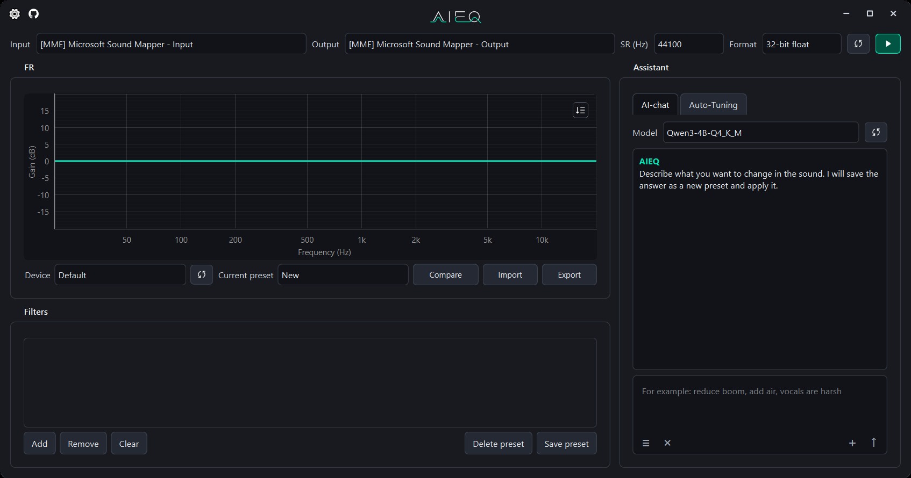
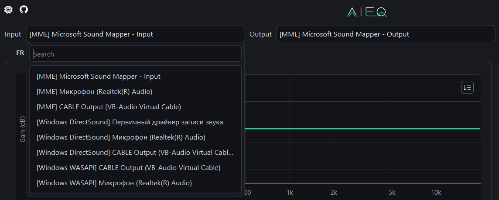
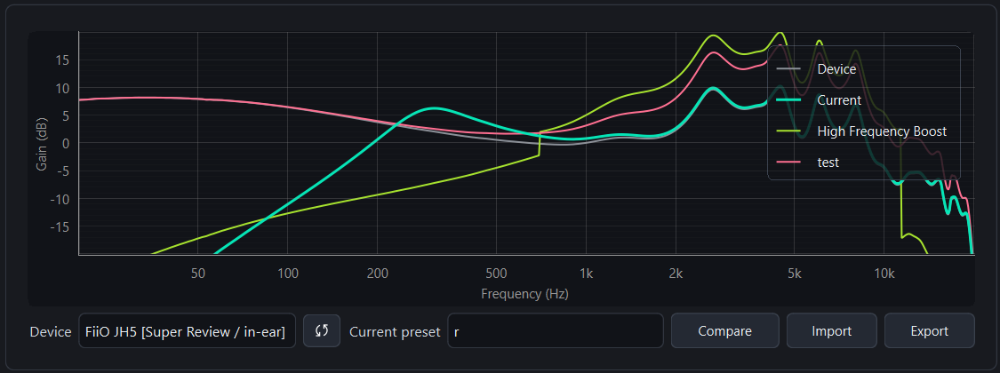
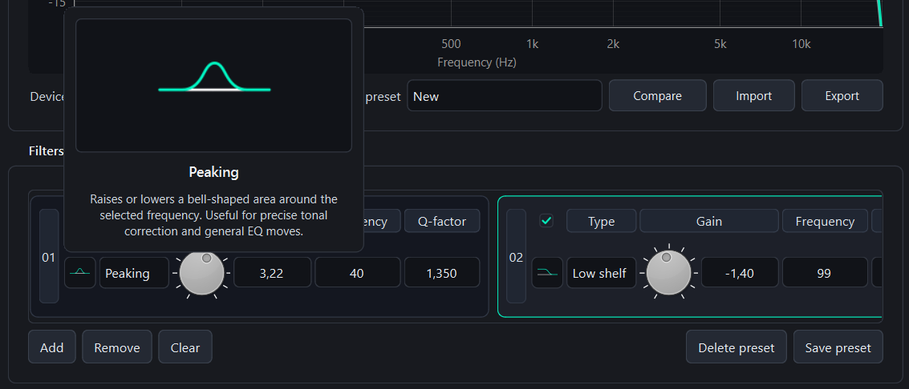
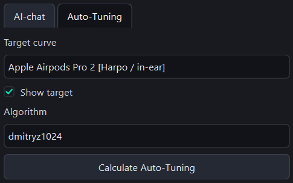
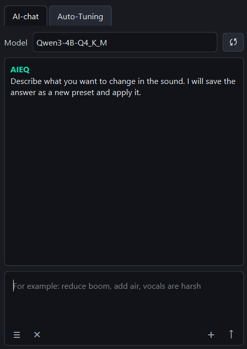
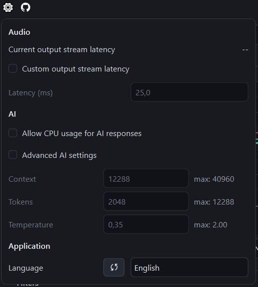

# AIEQ

[Russian version (Русская версия)](README-RU.md)

AIEQ is a parametric equalizer for Windows 10/11 with manual filter editing, preset comparison, an auto-tuning plugin, and an AI chatbot. The application is designed to work through the VB-Cable virtual audio cable: system audio is routed into AIEQ, processed by filters, and returned to the selected output device.



## 1. Features

- frequency response graph with the current preset, saved presets for comparison, and the selected device response;
- filters `peaking`, `low shelf`, `high shelf`, `low pass`, `high pass`, `band pass`, `notch`;
- envelope-style filter mixing: overlapping filters are not summed as a cascade;
- JSON preset import/export and SQLite preset storage in `%APPDATA%\AIEQ`;
- AI chat through a local GGUF model and `llama-cpp-python`;
- support for the official [`autoeq`](https://github.com/jaakkopasanen/AutoEq) package backend on Python 3.11 with almost 7000 device curves to choose from.
- auto-tuning plugin with 2 solutions: the original algorithm by the developer of the package mentioned above (`jaakkopasanen`) and my modified version (`dmitryz1024`).

[Screencast](https://drive.google.com/file/d/1CIRGF4145KUJEnWvs8e4yJUtxBlE__0m/view?usp=sharing)

## 2. Installation And Launch

### Via setup.exe

1. Download [`aieq-<version>-setup.exe`](https://github.com/dmitryz1024/aieq/releases/tag/v0.1.0) from GitHub Releases.
2. Run the installer as a regular user. If Windows asks for administrator rights, confirm.
3. Choose the installation folder. A folder named `aieq` will be created inside it.
4. Wait while the installer downloads the default AI model into the `models` folder.
5. If the installer offers to install VB-Cable, complete the driver installation.
6. After installing VB-Cable, it is recommended to restart the computer.

After installation, these folders should be located next to `AIEQ.exe`:

```text
assets\
curves\
languages\
models\
runtime\
```

### Via Repository Clone

Clone the repository:

```powershell
git clone https://github.com/dmitryz1024/aieq
```

Run:

```powershell
uv sync --python 3.11 --extra dev --extra autoeq --extra ai
uv run python -m source
```

Look for the AI model in `.gguf` format here: [click](https://huggingface.co/), and place it in the `models` folder.

Look for the `.dll` and `.exe` files required for GPU model execution here: [click](https://github.com/ggml-org/llama.cpp/releases), and place them in the `runtime` folder.

Tests (pytest, ruff, pyrefly) are run using the following command:
```powershell
uv run python -m tests.check_all
```

## 3. Audio Route Setup

Typical route:

1. In Windows, select `CABLE Input` as the default output device.
2. In AIEQ, select the device corresponding to VB-Cable output in the `Input` field.
3. In the `Output` field, select your real headphones, speakers, or external DAC.
4. Select the sample rate (`SR (Hz)`) and output stream format. If unsure, keep the default option.
5. Press the start button.



If there is no sound:

- first make sure you use the same audio subsystem for both input and output (shown in square brackets before the device name)
- press the audio device list refresh button;
- check that VB-Cable is installed and available in Windows settings;
- make sure Windows is actually sending audio to `CABLE Input`;
- try different subsystems to start the stream if several are available.

## 4. Working With The Graph

The frequency response section displays:

- the selected device curve;
- the current editable preset;
- the auto-tuning target curve, if enabled;
- saved presets for comparison.

The `Compare` button opens the list of saved presets. You can select several presets or choose `As many as possible` if you need to quickly show available presets within the display limit (15 items).



## 5. Devices And Target Curves

Device curves are stored in:

```text
curves\devices\
```

Target curves are stored in:

```text
curves\targets\
```

To add new curves:

1. Copy `.txt` or `.csv` files into the required folder.
2. Press the curve list refresh button in the application.
3. Select the new curve from the list.

Curve format: frequency and value in dB in two columns, for example:

```text
20 -3.1
100 -1.4
1000 0.0
10000 2.2
```

## 6. Manual Filter Editing

One filter contains:

- `Type` - filter type;
- `Gain` - level change in dB;
- `Frequency` - center frequency or cutoff frequency;
- `Q factor` - quality factor that affects the width of the effect.

Available types:

- peaking;
- low shelf;
- high shelf;
- low pass;
- high pass;
- band pass;
- notch.

A more detailed description of each type is available inside the application by pressing the mini-icon in the filter card, to the left of the type name.



For most musical tasks, it is better to start with `peaking`, `low shelf`, and `high shelf`. `low pass`, `high pass`, `band pass`, and `notch` filters should be used carefully: they change the structure of the signal more strongly and are more often needed for special tasks.

## 7. Presets

The current preset is selected in the `Current preset` list. The `New` item creates a new editable preset.

Available actions:

- save preset;
- delete preset;
- import in JSON format;
- export in JSON format;
- compare the current preset with saved ones.

## 8. Auto-Tuning

The auto-tuning tab builds a preset from the selected device curve and target curve (it adjusts the current device curve toward the target).

1. Select a device.
2. Open the auto-tuning tab.
3. Select a target curve.
4. Select an algorithm.
5. Press `Calculate auto-tuning`.

After calculation, the new preset is saved, becomes current, and is displayed on the graph.



## 9. AI Chatbot

The AI chatbot accepts a normal text request and returns a new preset. The model receives the context of the current device, current preset, chat history, and, if the request contains the name of any already saved preset, that preset's data.

Example requests:

```text
Make the sound softer and calmer, without harsh upper mids.
```

```text
Add a little bass density, but do not touch the sub-bass.
```

```text
Refine preset AIEQ 2026-05-06 | 01-59-52: slightly lift the vocal.
```



If the model is not connected, the application will show a system notification that the AI agent is not connected.

## 10. AI Models

Models are stored in:

```text
models\
```

To add a model:

1. Copy the `.gguf` file into `models`.
2. Press the model list refresh button.
3. Select the model from the dropdown list.

For GPU execution of the AI model, `llama-server.exe` and DLLs must be located in:

```text
runtime\
```

GPU availability check:

```powershell
.\runtime\llama-server.exe --list-devices
```

The output should contain `CUDA0`.

## 11. Interface Languages

Language files are stored in:

```text
languages\
```

To add a language:

1. Create a new `.json` using `ru.json` or `en.json` as a template.
2. Put the file into the `languages` folder.
3. Open the application settings.
4. Press the language list refresh button.
5. Select the new language.

## 12. Replacing Interface Images

Images are stored in:

```text
assets\
```

They can be replaced manually. Changes will be picked up after restarting the application.

## 13. Settings

The settings button opens application settings. There you can:

- view the current audio stream latency;
- enable custom latency;
- enable advanced AI settings;
- allow or disallow CPU use for AI response generation;
- change the interface language.



## 14. Useful scripts

In the `scripts` folder, you will find a number of useful utilities that allow you to:
- reset window layout dimensions to default values
```powershell
uv run python -m scripts.reset_window_layout
```
- synchronize device and target curve lists with the latest updates from the [`autoeq`](https://github.com/jaakkopasanen/AutoEq) package
```powershell
uv run python -m scripts.sync_autoeq_curves
```
- check supported stream parameters for a specific input/output device pair
```powershell
uv run python -m scripts.check_audio_formats
```

## 15. Common Problems

### No Sound

- Check every stage of the audio stream: Windows -> VB-Cable -> AIEQ -> output device.
- Press the audio device refresh button.
- Try another subsystem of the same device.
- Make sure the application stream is running.

### AI Does Not Respond

- Check that the model is in `models`.
- Check that `runtime\llama-server.exe` exists.
- Run `runtime\llama-server.exe --list-devices`.
- If the GPU is unavailable, allow CPU use in settings (for diagnostics only).

### Auto-Tuning Takes A Long Time

The original auto-tuning algorithm may be slightly slower than the local one. Try both algorithms one by one to find the best option for your tasks.

### New Files Did Not Appear In Lists

Press the corresponding refresh button:

- languages - in settings;
- models - in the AI tab;
- curves - in the frequency response section;
- audio devices - in the top route row.
